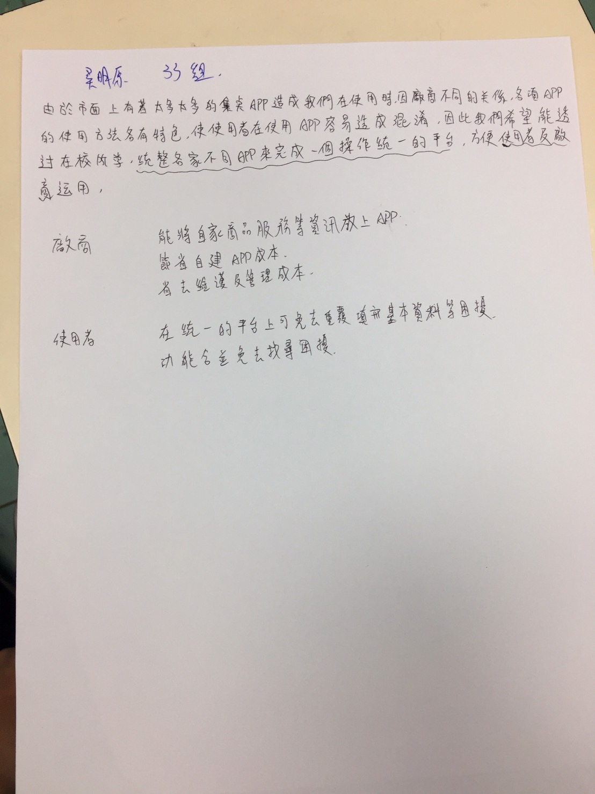

# 小組成員:0424052 吳明原
小組成員資料、專題目標、所有的圖表、程式碼、PPT期中修正版、PPT期末報告
# 專題介紹
  專案理由：推出攤商即時資訊平台APP，使消費者、攤商、商圈管理者及招商單位互惠的平台。  
  專案功能：獲取即時性攤商資訊，幫助攤商行銷與協助管理攤販快速媒合攤商。  
  預期效益：攤販提升曝光機率的機會進而增加營收外，能讓使用者迅速了解周遭攤商位置及營業概況，滿足顧客對未知的不確定心理，以促進購買欲望。  

